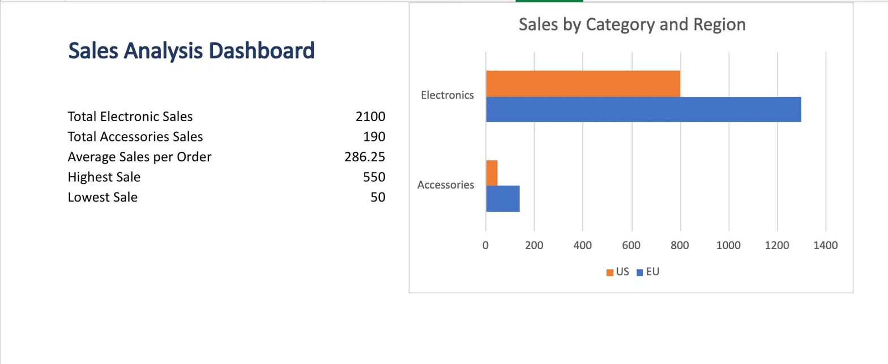

# Sales Analysis Excel Project

## Overview

This project analyzes sales performance using Microsoft Excel. The objective was to answer business questions, summarize sales data, and build an interactive dashboard using core Excel data analysis techniques.

## Dashboard Preview

## Dataset

The dataset contains sales transaction data with the following fields:

* Order ID
* Product
* Category
* Region
* Sales

## Business Questions Answered

* What are the total Electronics sales in the EU?
* What are the total Accessories sales in the EU?
* What are the total sales in the US?
* How many Electronics orders were placed in the EU?
* How many orders were placed in the US?
* How many Accessories orders were recorded?
* What are the total Electronics sales?
* What are the total Accessories sales?
* What is the average sales value?
* What are the highest and lowest sales values?

## Excel Skills Demonstrated

* XLOOKUP
* SUMIF
* SUMIFS
* COUNTIF
* COUNTIFS
* AVERAGE
* MAX
* MIN
* Pivot Tables
* Pivot Charts
* Conditional Formatting
* Slicers
* Dashboard Creation

## Key Findings

* Electronics generated $2,100 in sales.
* Accessories generated $190 in sales.
* The EU region generated higher revenue than the US region.
* The highest individual sale was $550.
* The lowest individual sale was $50.

## Files Included

* sales-analysis-project.xlsx
* dashboard.jpg
* README.md

## Project Purpose

This project was created as part of my Data Analyst learning journey to practice Excel-based data analysis, reporting, dashboard creation, and data visualization using Microsoft Excel.
